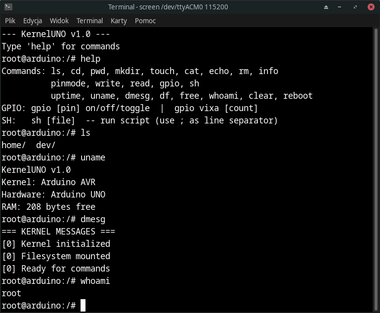

# KernelUNO

KernelUNO is a Unix-like shell interface written for the Arduino Uno R3 microcontroller board.

It includes a simulated RAM-based filesystem, basic system monitoring utilities, hardware and GPIO control, scripting support, and more.

For information on using KernelUNO, see `MANUAL.md`.
